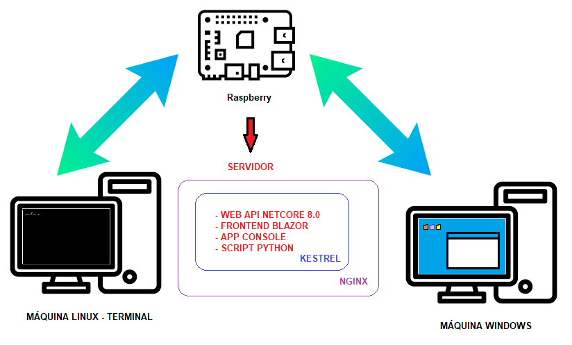

### O Projeto
---
Este projeto nasceu de uma necessidade  e de uma curiosidade

**A Curiosidade:**

Usar o Blazor.

**A Necessidade:**

Ao acessar uma máquina Linux somente terminal, gostaria de poder colar uma linha de comando que fosse capturada de outra máquina que tivesse IDE Gráfica. 
Claro existem algumas soluções prontas disponiveis para isso como o https://pastebin.com/ . Mas queria algo mais prático e direto. 

Além disso como já possuo um Raspberry Pi 4 funcionando como um servidor pessoal na minha rede, fiquei interessado na implantação do C# na plaforma ARM64, Enfim.
Apenas um dia normal na cabeça de um Dev.

No Final  o projeto foi extruturado em 3 partes:

- 1 Uma WebApi que fica em memória, recebe e guarda o conteúdo do que foi enviado pelo fronte end em um *Dictionary*.
- 2 Uma interface simples feita com Blazor, para que eu pudesse enviar e receber conteudo por qualquer máquina da minha rede.
- 3 Um programa console feito em C# que ao ser chamado, lesse o conteúdo guardado em  memoria e despejasse ele na linha de comando do Linux.
- 4 Um Script Python que  faz o mesmo que o programa console em C#, Só que de forma mais direta e elegante (Achei que o App Console C# ficou um trambolho depois do Deploy, mas mantive no código)

#### --- NOTA ADICIONAL ---
---
Como problema pouco para Dev é bobagem, adicionei também uma lib
compartilhada no projeto, que é responsavel por fazer a criptografia do
conteudo do "clipboard" que fica guardado na memoria do servidor.

##### BECAUSE YES.
---

#### --- DISCLAMER ---
	
---
Sou Dev Backend C#, então essencialmente não mexo muito frontend por isso usei auxilo de I.A. (É o que a molecada usa para sobreviver no mundo hoje. Não?) para algumas dúvidas, 
assim como não sou (Não era) especialista em impantações com Kestrel e Nginx. 

No final fiquei impressionado como o StackOverFlow ainda me auxiliou melhor com problemas verdadeiramente complexos.
Obrigado humanos!

Procurei seguir as melhores práticas *(blá, blá, blá, Clean Code, blá, blá, blá interfaces,blá, blá, blá SOLID)*. Mas como é só um projeto pessoal e de estudo, não sejam muito duros. 
Pensei em colocar testes unitários, se o código atual estiver com eles é acabei colocando. 

:-/

---

#### Estrutura

SERVER PROJECTS
  - Server_API  - API com as regras de negocio
    https://github.com/lauristi/Server_API_Solution
  
  - Server_Web  - Interface Blazor
    https://github.com/lauristi/ServerClipboard_Web_Solution

  - cclip - Script Python para acesso em linha de comando
    https://github.com/lauristi/cclip

  - EncryptionLib - Lib de encriptação de  dados
    https://github.com/lauristi/EncryptionLib_Solution



*Aqui um pequeno esquema de como imaginei a coisa toda*


*Aqui a interface super simples usando blazor*


### Configurando o projeto para rodar com portas pré definidas tanto em desenvolvimento como em produção


Quando você executa um aplicativo em modo de depuração (debug) no Visual Studio, ele geralmente usa um porta padrão atribuída às configurações de desenvolvimento. No caso de uma aplicação WebAPI em C# .NET Core, a porta padrão geralmente é a 5000 para HTTP e a 5001 para HTTPS. Essas portas podem ser configuradas no arquivo **launchSettings.json** dentro da pasta **Properties** do seu projeto.

Para fixar a execução em uma porta especifica, tanto em **Development** quando Release. Deve-se adicionar uma diretiva “Kestrel” no arquivo **appsettings.json**

```
{
  "Logging": {
    "LogLevel": {
      "Default": "Information",
      "Microsoft.AspNetCore": "Warning"
    }
  },
  "AllowedHosts": "*",
  "Kestrel": {
    "EndpointDefaults": {
      //"Protocols": "Http1AndHttp2"
    },
    "Endpoints": {
      "Http": {
        "Url": "http://localhost:5010"
      },
      "Https": {
        "Url": "https://localhost:5012"
      }
    }
  }
}
```
*Neste exemplo o Kestrel é instruído a executar a aplicação nas portas 5010 e 5012 para http e https*

Quando esta alteração é feita, as configurações de porta em **appsettings.json** podem entrar em conflito com as configurações de porta em **lauchsettings.json**. Isso irá causa uma mensagem de Warning na saída do compilador.

Para evitar este problema adicione a diretiva:

```
externalUrlConfiguration": true, 
```


```
{
  "$schema": "http://json.schemastore.org/launchsettings.json",
  "iisSettings": {
    "windowsAuthentication": false,
    "anonymousAuthentication": true,
    "iisExpress": {
      "applicationUrl": "http://localhost:41234",
      "sslPort": 44394
    }
  },
  "profiles": {
    "http": {
      "commandName": "Project",
      "dotnetRunMessages": true,
      "launchBrowser": true,
      "externalUrlConfiguration": true, 
      "launchUrl": "swagger",
      "applicationUrl": "http://localhost:5077",
      "environmentVariables": {
        "ASPNETCORE_ENVIRONMENT": "Development"
      }
    },
    "https": {
      "commandName": "Project",
      "dotnetRunMessages": true,
      "launchBrowser": true,
      "externalUrlConfiguration": true, 
      "launchUrl": "swagger",
      "applicationUrl": "https://localhost:7251;http://localhost:5077",
      "environmentVariables": {
        "ASPNETCORE_ENVIRONMENT": "Development"
      }
    },
    "IIS Express": {
      "commandName": "IISExpress",
      "launchBrowser": true,
      "launchUrl": "swagger",
      "environmentVariables": {
        "ASPNETCORE_ENVIRONMENT": "Development"
      }
    }
  }
}
```

*Exemplo de lauchsettings.json com a diretiva aplicada*


### [WebAPI]
### Configurações adicionais para o Program.cs para que em produção a aplicação seja servida corretamente pelo kestrel
---

```
var builder = WebApplication.CreateBuilder(args);

//==============================================================================================
// Configure o Kestrel para ouvir em todas as interfaces de rede na porta 5020
//==============================================================================================

if (!builder.Environment.IsDevelopment())
{
    builder.WebHost.ConfigureKestrel(options =>
    {
        // Listen on a specific network interface (e.g., Ethernet) on port 5020
        options.Listen(System.Net.IPAddress.Parse("192.168.0.156"), 5020);
    });
}
//==============================================================================================
```
*Adicione a porta do aplicativo, no exemplo, a porta 5020 foi escolhida*


```
//REMOVIDO PRA EVITAR ERRO DO CORS
//app.UseHttpsRedirection();
```
*Necessário na versão NetCore 8.0 até a presente data deste doc*.


```
//==============================================================================================
//Configuracao de Cabecalho encaminhado para funcionar com proxy reverso... Ngnix
//==============================================================================================
app.UseForwardedHeaders(new ForwardedHeadersOptions
{
    ForwardedHeaders = ForwardedHeaders.XForwardedFor | ForwardedHeaders.XForwardedProto
});
```
*Configuração necessária para um arranjo com Ngnix*


##### Configuração adicional:

```
//if (app.Environment.IsDevelopment())
//{
    app.UseSwagger();
    app.UseSwaggerUI();
//}
```
* Caso queira deixar o Swagger ativo em produção somente para um debug temporario, matenha comentado dessa forma.*


### [Blazor FrontEnd]
### Configurações adicionais para o Program.cs para que em produção a aplicação seja servida corretamente pelo kestrel
---

```
//========================================================================================================
// Configure o Kestrel para ouvir em todas as interfaces de rede na porta 5020
// Adiciona o middleware UseStaticWebAssets para servir arquivos estáticos, incluindo CSS, em produção
//========================================================================================================

if (!builder.Environment.IsDevelopment())
{
    builder.WebHost.UseWebRoot("wwwroot")
                   .UseStaticWebAssets();
    
    builder.WebHost.ConfigureKestrel(options =>
    {
        options.Listen(IPAddress.Parse("192.168.0.156"), 5021);
    });
}
//========================================================================================================
```

```
//========================================================================================================
//Configuracao de Cabecalho encaminhado para funcionar com proxy reverso... Ngnix
//========================================================================================================
app.UseForwardedHeaders(new ForwardedHeadersOptions
{
    ForwardedHeaders = ForwardedHeaders.XForwardedFor | ForwardedHeaders.XForwardedProto
});
```

#### Caso não esteja usando nenhum tipo de autenticação , remova para evitar erros.

```
//REMOVIDO PARA EVITAR ERRO DE AUTENTICACAO DO
//Microsoft.AspNetCore.Authentication.IAuthenticationSchemeProvider
//No Raspbery PI

//app.UseAuthentication();
```


### Implantação .Netcore no Linux com Kestrel e Ngnix
---


#### Ngnix
---
Depois de instalar o Nginx é preciso alterar o arquivo **default** em: ```/etc/nginx/sites-available```

```
server {
   #listen 80;
    listen 80 default_server;
    listen [::]:80 default_server;
    server_name   srv.local;

    #rasp Server Clipboard WebAPI (Backend)
    location /api/ {
        proxy_pass         http://192.168.0.156:5020;
        proxy_set_header   Upgrade $http_upgrade;
        proxy_set_header   Connection keep-alive;
        proxy_set_header   Host $host;
        proxy_cache_bypass $http_upgrade;
        proxy_set_header   X-Forwarded-For $proxy_add_x_forwarded_for;
        proxy_set_header   X-Forwarded-Proto $scheme;
    }

    #rasp Server Clipboard BlazorWebApp (Frontend)
    location /api/ {
        proxy_pass         http://192.168.0.156:5021;
        proxy_set_header   Upgrade $http_upgrade;
        proxy_set_header   Connection keep-alive;
        proxy_set_header   Host $host;
        proxy_cache_bypass $http_upgrade;
        proxy_set_header   X-Forwarded-For $proxy_add_x_forwarded_for;
        proxy_set_header   X-Forwarded-Proto $scheme;
    }
}
```
*Exemplo de código para o arquivo default do Nginx*


### Kestrel
---
Para implantar corretamente uma aplicação .NET Core no Linux, é necessário criar um arquivo de serviço (**kestrel.service**) para gerenciar o processo do Kestrel como um serviço do sistema. Isso permite que o Kestrel seja executado como um serviço em segundo plano, gerenciado pelo sistema operacional.

O Arquivo deve ser criado em: ```/etc/systemd/system/```


```
[Unit]
Description=My .NET Core App
After=network.target

[Service]
User=www-data
Group=www-data
WorkingDirectory=/path/to/your/app
ExecStart=/usr/bin/dotnet /path/to/your/app/YourApp.dll
Restart=always
RestartSec=10
SyslogIdentifier=YourApp
Environment=ASPNETCORE_ENVIRONMENT=Production

[Install]
WantedBy=multi-user.target
```
*Exemplo de um conteudo padrão para um arquivo Service do Kestrel. Geralmente o nome do arquivo segue um padrão como: kestrel-app.service (onde app é o nome da app)*

#### Configuraçao no arquivo no Linux (colocando o Kestrel para rodar)

Certifique-se de substituir */path/to/your/app* pelo caminho real para a pasta onde sua aplicação está localizada e *YourApp.dll* pelo nome do arquivo DLL principal da sua aplicação.

Carregue os Serviços do systemd com o comando:
```
sudo systemctl daemon-reload
```

Agora você pode iniciar o serviço Kestrel com o comando:
```
sudo systemctl start kestrel-app.service
```

Garanta que sua aplicação .NET Core seja executada como um serviço do sistema gerenciado pelo systemd no Linux.
```
sudo systemctl enable kestrel-app.service
```

**A saber:**

*1 -Remova toda e qualquer referência a hppts no código, caso não tenha um domínio //próprio. O https simplesmente não funciona bem com certificados auto assinados.*

*2- Até a publicação desse doc o .NetCore 8.0 apresentava um bug que não permitia acesso aos arquivos estáticos em wwwroot*


#### SCRIPTY PYTHON

```
import requests

url = 'http://192.168.0.156:5020/api/clipboard/get'

try:
    response = requests.get(url)
    response.raise_for_status()  # Lança uma exceção para códigos de erro HTTP

    if response.status_code == 200:
        data = response.json()
        clipboard_data = data.get('clipboard', '')
        print("Clipboard data:", clipboard_data)
    else:
        print(f"Failed to get clipboard data. Status code: {response.status_code}")

except requests.exceptions.RequestException as err:
    print(f"Request Exception: {err}")
```
#### Arquivo clip.py que pode ser rodado como um comando no Linux, com os devidos ajustes. 

##### 1- Acrescente esta linha ao inicio do arquivo Phyton:
```
#!/usr/bin/env python3
```
##### 2- Torne o arquivo de script executável:
```
chmod +x clip.py
```
##### 3- Adicione o caminho do script ao PATH
   *Para tornar adição do caminho ao Path Edite o arquivo **.bashrc** principal adicionando a linha:*
```
export PATH=$PATH:/var/www/app/ServerClipboard/phyton
```
##### 4- Por fim para poder executar o script como um comando, sem a extensão do python (.py) cruie um link simbólico:
```
ln -s /var/www/app/ServerClipboard/phyton/clip.py /var/www/app/ServerClipboard/phyton/clip
```


